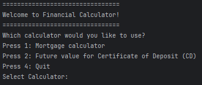

#  Financial Calculator

### This project encapsulates so far two calculators:
1. Mortgage Calculator
2. Future value for Certificate of Deposit (CD)

# 🧠 Features
## 🏠 Mortgage Calculator
* Calculates monthly payments and total interest based on:
  * Principal (loan)
  * Interest rate (as a percentage)
  * Loan term in years

## 💰 Future Value for Certificate of Deposit (CD)
* Calculates CD value and interest earned based on:
  * Initial deposit
  * Interest rate
  * Term in years (compounded daily)

# 📸 Screenshot of Outputs
## 🖥️ Home Screen

## 🏠 Mortgage Calculator

## 💰 Future Value for Certificate of Deposit (CD)

# ⚠️ Error Handling
### 🔴 If the user enters an invalid value (e.g., letters instead of numbers), the program will display an error message and prompt them to try again.
* 🟢 Green is user input

# 🧩 Fun Fact
### 📘The calculator continues to run in a loop until the user chooses to exit, so there's no need to restart the program after each calculation.

# 🧑‍💻 Author
💻 Developed by: Meixin Zhang
📅 Date: April 13th, 2025

Created with ❤️ using Java.
